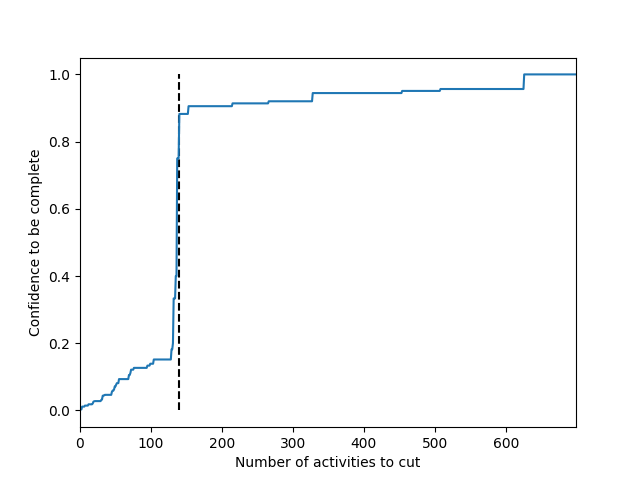
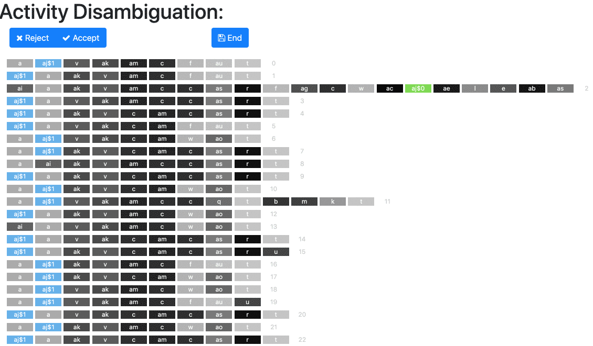
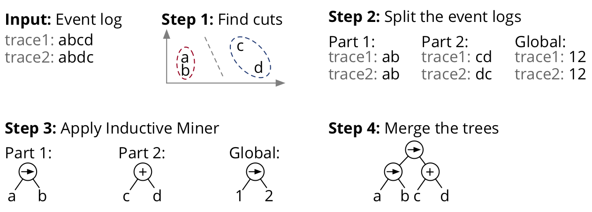
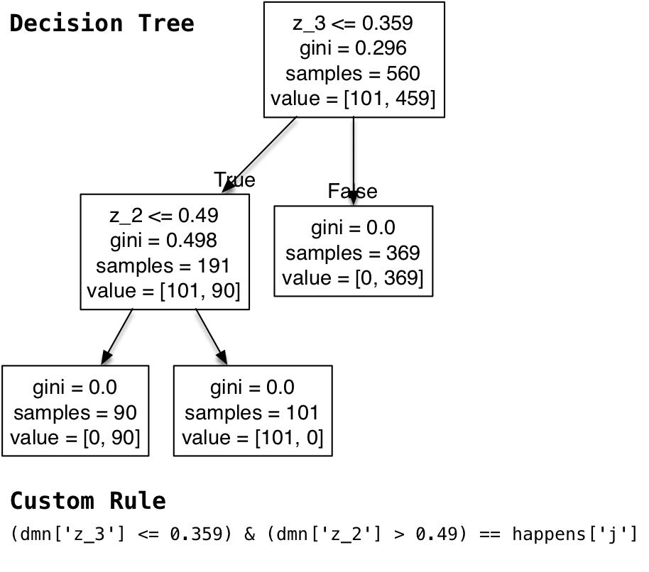

# Process Discovery Challenge

## Introduction
This is our contribution for the [Process Discovery Challenge](https://icpmconference.org/process-discovery-contest). More information about our approach are available [here](TODO).

## Prerequisites
You should run the code using Python 3.6.2 with Pandas, Sklearn, and Numpy installed. Some steps require the use of the open source software [ProM](http://www.promtools.org/doku.php).

## How to use
Our algorithm is composed of 4 sequential steps.
1. [Remove incomplete trace](#step-1-remove-the-trace-that-are-considered-incomplete)
1. [Disambiguate activity (recurrent activities)](#step-2-rename-the-activities-that-are-ambiguous)
1. [Cut the traces before applying the Inductive Miner](#step-3-find-cuts-in-the-traces-before-feeding-it-to-the-inductive-miner)
1. [Mine DMN rules](#step-4-mine-rules)

### Step 1: remove the trace that are considered incomplete
We know for a fact that 20% of the traces are incomplete. We remove them using the script: *[1_incomplete/incomplete.py](1_incomplete/incomplete.py)*. 
 
 1. Update the dataset ID 
```python
dataset_id = 10
```
 2. Run 1_incomplete/incomplete.py. Use the generated charts (1_incomplete/plt/) to select the number of traces to cut. Below we can cleary see a lift at 140. Hence, 140 would be a good choice. Enter 140 and press enter.
```
how many activities to cut?: 140
```


3. The output, the dataset without the incomplete trace, is available in 1_incomplete/dataset/dataset.csv. This is the dataset that should be used in the following steps.

### Step 2: rename the activities that are ambiguous
Some activity labels are ambiguous: The same letter is used for activities that happen in different context. They are named *recurrent activities* in the [ProcessCharacteristics](data/instruction/ProcessCharacteristics.pdf). We rename these activities in semi-supervised way using the following algorithm : [2_disambiguate/guided-disambiguate.py](2_disambiguate/guided-disambiguate.py). 
 1. Update the path to the dataset and run the Algorithm. It will produce a web service.
 ```python
 log.read_csv('1_incomplete/dataset/dataset.csv')
```
2. Run the web interface that will allow to interact with the web service: [2_disambiguate/web/index.html](2_disambiguate/web/index.html). 
3. The web interface allows to interact with the data. The algorithm propose a solution to rename a label in two (green and blue). Review the proposition. If a specific activity is not well classified, e.g., it is blue instead of green, you can click on it to change its color. Once you are satisfied, you can accept the proposition and it will go to the next letter. Reject will also go to the next letter but will not save the current split proposed.
4. When to stop? The process goes on until all activities have been accepted or rejected. Note that a single label can be cut twice or more. For instance, we might split *c* in c$1 and c$2 and later c$1 in c$1$1 and c$1$2. The algorithm splits first the activities that have the biggest inner distance (i.e., more likely to be ambiguous). Hence, after several steps, most of the splits proposed are irrelevant. When you notice this, it is to stop the process by clicking "End". When you click on "End", it exports the resulting dataset under: .  

### Step 3: find cuts in the traces before feeding it to the inductive miner
The inductive miner works by finding the best split in the event logs. However, when there are many different labels, the Inductive Miner sometimes introduces loops in the data (event if none of the activities are repeated), resulting in a under-fitting models that allows for too many behaviors. Our idea, similar to the inductive miner, is to find splits in the traces before feeding it to the Inductive miner so that we provide multiple but shorter event logs to the Inductive Miner. 
 
  
 1. To find cuts, adapt the path to the dataset (see below) and the number of splits to apply. We did not find an automated way to find the ideal number of splits (the silhouette score does not seem relevant here). Therefore we recommend a trial and errors approach, trying from 2 to 10 cuts. 
```python
log.read_csv('/2_disambiguate_activities/output/dataset.csv')
number_of_cluster = 2
```
2. The resulting event logs are saved in the folder [3_cut/1_split/](3_cut/1_split/). For instance if number_of_clusters is 2, we will have: "0.xes", "1.xes" and "root.xes". Use [ProM](http://www.promtools.org/doku.php) and run the Inductive Miner on each of these three files. Using the same name, export the resulting Process Trees (ptml files) in the folder [3_cut/2_gather/](3_cut/2_gather/), e.g., "0.ptml", "1.ptml", and "root.ptml".
3. Run the algorithm [3_cut/2_gather.py](3_cut/2_gather.py). It will produce a merged process tree under [3_cut/2_gather/pt_renamed.ptml](3_cut/2_gather/pt_renamed.ptml). The process tree can easily be transformed into a BPMN or a Petri Net using [ProM](http://www.promtools.org/doku.php).

### Step 4: Mine rules
For the first time in the process discovery contest, some rules (DMN) can be hided in the data. Basically, some extra columns might impact the execution of the process. To Uncover these rules, we build a simple decision tree classifier limited to few (from 2 to 4) leaves to avoid overfitting.
1. In [4_rules/dmn.py](4_rules/dmn.py), update the path to the dataset and choose the maximum number of leaves in the Decision Tree (We recommend 4 leaves).
```python
log.read_csv('2_disambiguate_activities/output/dataset.csv')
max_leaf_nodes = 4
```
2. It will produce several Decision Trees. Manually inspect the decision trees to infer the decision rules as shown in the picture below.
 
3. In [4_rules/standalone-replayer.py](4_rules/standalone-replayer.py), adapt the paths to the training dataset and to the rules and run the algorithm to assess the fitness to the rules. Ideally, for the training dataset, 100% of the trace should fit the rules. 
```python
path_dataset = 'data/csv/log1-training.csv'
path_rules = '4_rules/trees/rules.txt'
```

### Step 5: Assess the Fitness
To check whether traces are fitting or not, we run several tests. The script [5_assess_fitness/replay.py](5_assess_fitness/replay.py) allows to run all these tests. 

```python
# Three tests will be run on feb-log10-training.csv
{
'feb-log10-training': {
        'path_log': '{}/data/csv/tests/feb-log10-training.csv'.format(root),
        'tests': {
            'conformance_imperative': '{}/results/log10/replay/feb.csv'.format(root),
            'conformance_dmn': '{}/results/log10/4_dmn/trees/rules.txt'.format(root),
            'conformance_complete': (.5, '{}/results/log10/1_incomplete/output/score/proba_feb.csv'.format(root))
        },
        'comments': '34/40'
    }
}
```

1. **conformance_imperative**: Check whether a trace fit a Petri Net. In order to do this, we replay in [ProM](http://www.promtools.org/doku.php) the event logs on the Petri Net using the plugin "Replay a Log on Petri Net for Conformance Analysis". We export the resulting "PNRepResult" from [ProM](http://www.promtools.org/doku.php) to get a CSV. In the code above, update the value of the key 'conformance_imperative' for the path of the exported CSV file.

2. **conformance_dmn**: Check whether a trace fit the DMN rules (from step 4). In the code above, update the value of the key 'conformance_dmn' for the path of the file containing the rules.

3. **conformance_complete**: Check whether a trace is complete according the decision tree (from step 1). In the code above, update the value of the key 'conformance_complete' for a tuple (1) min confidence to consider complete, and (2) path of the score; e.g., (0.5, "/1_incomplete/output/score/proba_feb.csv").

4. **conformance_declarative**: When it was not possible to mine inductive model of good quality (general enough to match almost all the training dataset while avoiding fitting all the test dataset), we generate declarative rules using the plugin "MINERful" in [ProM](http://www.promtools.org/doku.php). To assess whether the traces fit the declarative rules, we use the  plugin "Declare Replayer" and export the resulting "ResultReplayDeclare" to get a CSV. In the code above, update the value of the key 'conformance_declarative' for the path of the exported CSV file.


